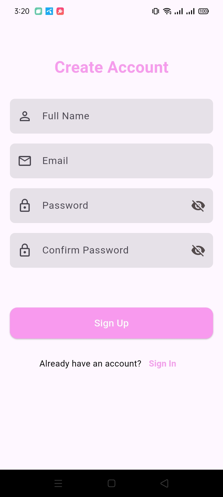
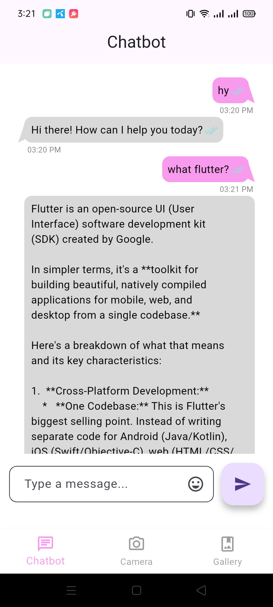

# Object Detector & Chatbot

AI Object Detector & Chatbot is a Flutter application that combines **image object detection** with an **AI-powered chatbot**. The app uses [Google ML Kit Image Labeling](https://pub.dev/packages/google_mlkit_image_labeling) to detect objects in images and [Gemini 2.5 Flash](https://ai.google.dev/gemini-api/docs) to provide intelligent chatbot responses.

<p float="left">
    
    
    
    
    
</p>

---

## Features

* **AI Chatbot:** Conversational AI using Gemini 2.5 Flash API.
* **Object Detection:** Detects and lists objects from images using ML Kit Image Labeling.
* **Camera & Gallery Support:** Pick images from camera or gallery.
* **Real-Time Description:** Chatbot generates descriptions of detected objects.
* **Dynamic UI:** Shows detected objects and chatbot responses in an interactive interface.

---

## Getting Started

Follow these steps to build and install the app on your device.

### Prerequisites

* [Flutter Setup](https://flutter.dev/setup/) installed and configured.
* Android SDK with the following settings in `android/build.gradle.kts`:

```kotlin
minSdkVersion = 21
targetSdkVersion = 35
compileSdkVersion = 35
```

* Camera permission in `Android/app/src/main/AndroidManifest.xml`:

```xml
<uses-permission android:name="android.permission.READ_EXTERNAL_STORAGE"/>
<uses-permission android:name="android.permission.WRITE_EXTERNAL_STORAGE"/>
<uses-permission android:name="android.permission.CAMERA"/>
```

---
### Building and Installing

1. **Obtain Gemini API Key:**

   * Go to [Google AI Studio](https://aistudio.google.com/api-keys)
   * Create a new API key.

2. **Add API Key:**

   * Option 1: Store in your app config (e.g., `app_url.dart`).
   * Option 2: Pass via `--dart-define` flag:

```bash
flutter run --dart-define API_KEY=$GOOGLE_API_KEY
```

3. **Run the App:**
   The app will use the Gemini API to generate chatbot responses.

---